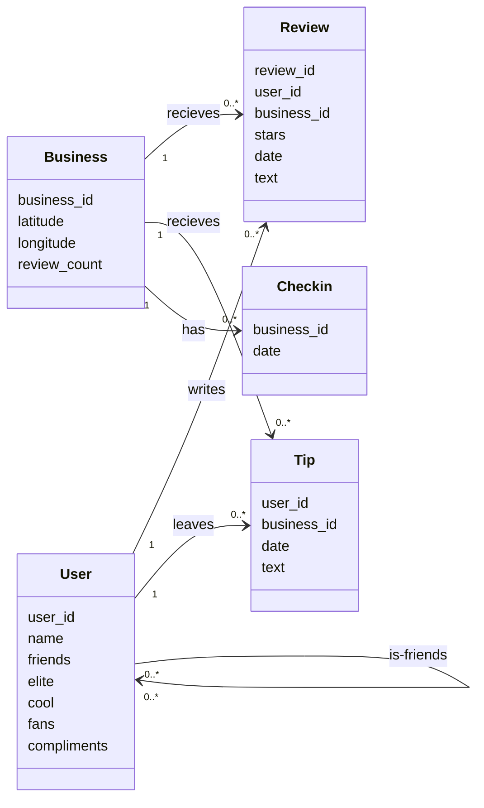
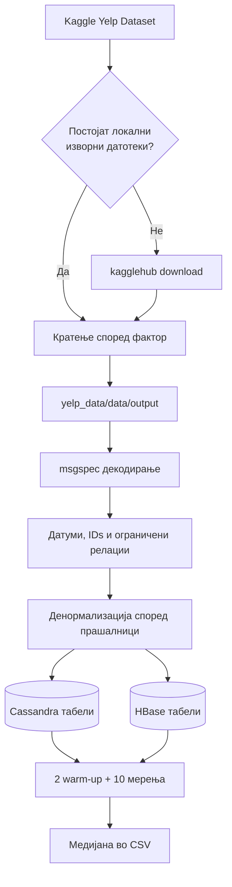
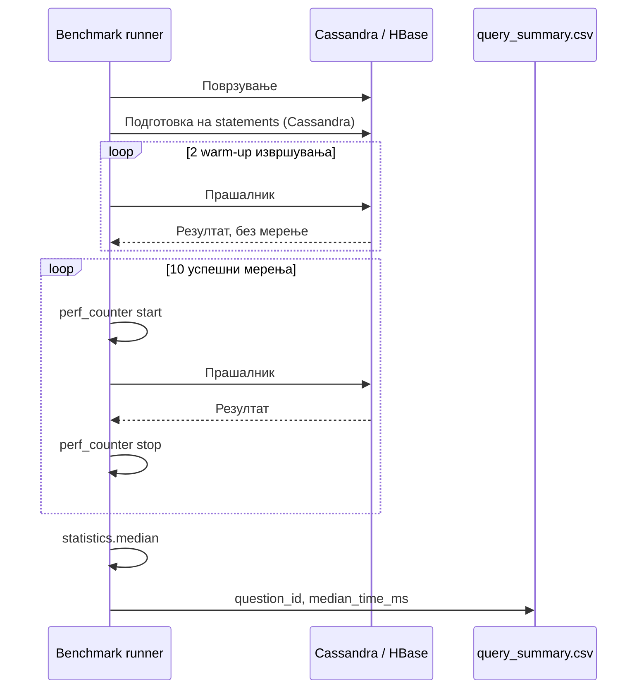

# Column based NoSQL бази на податоци

## Cassandra и HBase

**Предмет:** _[име на предметот]_<br>
**Ментор:** _[име на менторот]_<br>
**Членови на тимот:** _[имиња и индекси]_<br>
**Датум:** _[датум на предавање]_

---

## Апстракт

Во овој проект се споредуваат Apache Cassandra и Apache HBase како две
NoSQL бази ориентирани кон широки колони. Заедничката основа е Yelp Open
Dataset кде што податоците се претпроцесираат и се
денормализираат во модели приспособени на десет однапред дефинирани пристапни
шаблони. Експериментот се извршува локално преку Docker, а прашалниците се извршени и мерени со Python.

За секој прашалник се извршуваат две 'warm-up' извршувања и десет успешни
мерени извршувања. Како резултат се користи медијаната на времето во
милисекунди. Во зачуваните резултати HBase е побрз кај девет од десет
прашалници, додека Cassandra има мала предност кај прашалникот за глобалното
рангирање на корисник.

## Содржина

1. [Вовед](#1-вовед)
2. [Работна околина и поставување](#2-работна-околина-и-поставување)
3. [Податочно множество и претпроцесирање](#3-податочно-множество-и-претпроцесирање)
4. [Моделирање и вчитување](#4-моделирање-и-вчитување)
5. [Методологија на експериментот](#5-методологија-на-експериментот)
6. [Резултати и анализа](#6-резултати-и-анализа)
7. [Заклучок](#7-заклучок)

---

# 1. Вовед

## 1.1. Предмет на споредбата

Со растот на количеството и брзината на создавање податоци, класичниот
релациски модел не е секогаш најпрактичен избор. NoSQL системите често
прифаќаат денормализација и послаби релациски ограничувања за да овозможат
хоризонтално скалирање и ефикасен пристап според однапред познати шаблони.

Cassandra и HBase припаѓаат на фамилијата wide-column, односно бази со широки
колони. Во двете технологии физичкиот модел се проектира според use case-от,
а не само според ентитетите. Сепак, тие имаат различни програмски и
оперативни модели:

- **Cassandra** ги организира податоците преку партициски и clustering клучеви
- **HBase** ги организира записите лексикографски според row key

Целта тука е споредба на медијаните на execution time на 10 логички исти queries.

## 1.2. Концептуален модел

Изворните Yelp датотеки претставуваат пет поврзани ентитети. Врските се
семантички: NoSQL шемите не дефинираат надворешни клучеви, туку ги копираат
потребните идентификатори и атрибути во табели оптимизирани за читање.



*Слика 1. Концептуални ентитети и врски во Yelp податочното множество.*

---

# 2. Работна околина и поставување

## 2.1. Cassandra поставување

Cassandra се стартува преку `cassandra/docker-compose.yml`, кој го презема и
стартува `cassandra:latest` image-от. Контејнерот ја изложува стандардната CQL
порта **9042**, преку која се поврзува Python клиентот. Клиентот го користи локален data center за да ги препознае и претпочита
локалните Cassandra јазли и правилно да ги распределува CQL барањата.

Основно стартување и вчитување:

```bash
uv sync --package cassandra-nosql
docker compose -f cassandra/docker-compose.yml up -d
uv run --package cassandra-nosql python -m cassandra_nosql.load_data
```

Loader-от го брише и повторно го создава целиот `nosql` keyspace. Потоа
стартува до три процеси паралелно за вчитување на денормализираните табели.

## 2.2. HBase поставување

HBase користи image `openeuler/hbase` и работи локално, во недистрибуиран
режим. Во контејнерот Master-от ја координира базата, RegionServer-от ги чува
и опслужува табелите, а ZooKeeper се користи за нивна меѓусебна координација.
Thrift сервисот е потребен за Python апликацијата да пристапува до HBase преку
HappyBase, а клиентот се поврзува на порта `9090`. Податоците се чуваат во
Docker volume за да останат достапни и по рестартирање на контејнерот.

Стартувањето и целосното подготвување се извршуваат со:

```bash
docker compose -f hbase/docker-compose.yml up -d
uv run --package hbase poe -C hbase bootstrap_hbase
```

Bootstrap задачата го извршува заедничкото кратење на dataset-от, ги брише
постојните експериментални табели, ги создава повторно и ги вчитува податоците
со најмногу три паралелни worker процеси.

# 3. Податочно множество и претпроцесирање

## 3.1. Yelp Dataset

Податоците се преземаат од Kaggle dataset-от `yelp-dataset/yelp-dataset`.
Форматот е NDJSON: секоја линија е посебен JSON објект. Проектот ги користи
следните пет датотеки:

| Изворна датотека | Содржина | Оригинални записи |
|---|---|---:|
| `yelp_academic_dataset_business.json` | бизниси, координати и број на рецензии | 150,346 |
| `yelp_academic_dataset_checkin.json` | датуми на checkins по бизнис | 131,930 |
| `yelp_academic_dataset_review.json` | оценки и текстуални рецензии | 6,990,280 |
| `yelp_academic_dataset_tip.json` | кратки tips од корисници | 908,915 |
| `yelp_academic_dataset_user.json` | корисници, пријатели и показатели | 1,987,897 |
| **Вкупно** | | **10,169,368** |

## 3.2. Преземање и кратење

Скриптата `yelp_data/get_data.py` го презема податочното множество и го
зачувува во `yelp_data/data`. Бидејќи целото множество е преголемо за овој
локален експеримент, `shared/trim.sh` подготвува помала верзија што ја користат
двете бази. Business и Checkin податоците се кратат со фактор 2, Tip со фактор
16, User со фактор 32 и Review со фактор 128. Подготвените датотеки се
зачувуваат во `yelp_data/data/output`.

| Ентитет | Фактор | Задржани записи | Приближно задржан дел |
|---|---:|---:|---:|
| Business | 2 | 75,173 | 50.00% |
| Checkin | 2 | 65,965 | 50.00% |
| Review | 128 | 54,612 | 0.78% |
| Tip | 16 | 56,808 | 6.25% |
| User | 32 | 62,122 | 3.13% |
| **Вкупно** | | **314,680** | **3.09%** |

<!-- 3.3 и 3.4 сум 50/50 дали да ги има или не ама ако ги оставиме треба да се rewordnat -->
<!-- ## 3.3. Подготовка на полињата

При вчитување, `msgspec` ги декодира JSON објектите во типизирани Yelp модели.
Потоа loader-ите ги применуваат следните трансформации:

- датумите се сведуваат на ISO датум `YYYY-MM-DD`;
- секој tip добива локален целоброен `tip_id`, за повторени tips од ист
  корисник да не се презапишуваат;
- името на авторот се копира во записот за рецензија;
- листите `friends`, `elite` и check-in датумите се разделуваат од текст;
- поради големината на релациите, се материјализираат најмногу првите пет
  пријатели и првите пет check-in датуми од секој изворен запис;
- personality score се пресметува како:

$$
\text{personality\_score} =
\frac{|friends| + |elite| + cool + fans}{4}
$$

HBase го кодира збирот во сортиран row key, додека Cassandra дополнително го
запишува score-от и однапред пресметаниот глобален ранг.

## 3.4. Целосен тек на обработка



*Слика 3. Од преземање на податоците до benchmark резултатите.* -->

---

# 4. Моделирање и вчитување

## 4.1. Пристапни шаблони

Физичките модели се изведени од десет исти прашања:

1. Најди го најблискиот бизнис до зададени координати, при иста оддалеченост
   дај предност на поголем `review_count`.
2. Најди ги tips за бизнисот во последните 60 дена.
3. Најди ги десетте корисници со најмногу tips за бизнисот во последните 365
   дена.
4. Најди го името за даден `user_id`.
5. Најди ја рецензијата со најмногу ѕвезди за даден бизнис.
6. За дадена рецензија прикажи ѕвезди, опис и име на авторот.
7. Прикажи ја перцепцијата за корисникот преку `compliment_hot`,
   `compliment_cute`, `compliment_cool` и `compliment_funny`.
8. Прикажи го глобалниот personality ранг на корисникот.
9. Прикажи ги рецензиите на корисникот од последните 365 дена, подредени по
   ѕвезди.
10. Прикажи ги имињата на пријателите на корисникот.

## 4.2. Cassandra логички модел

Cassandra користи десет табели во keyspace `nosql`. Партицискиот клуч
одредува на кој јазол би се чувале записите во кластер, а clustering колоните
го одредуваат редоследот внатре во партицијата.

| Табела | Клуч и редослед |
|---|---|
| `business` | `id` |
| `tips_by_business` | `business_id`; `tipped_at DESC`, `tip_id ASC` |
| `users_by_business` | `tip_business_id`; `tipped_at DESC`, `id`, `tip_id` |
| `user` | `id` |
| `review_by_business` | `business_id`; `stars DESC`, `review_id` |
| `review` | `id` |
| `user_by_personality_score` | `user_id`, со score и однапред пресметан rank |
| `review_by_user` | `user_id`; `stars DESC`, `reviewed_at DESC`, `review_id` |
| `user_by_friends` | `user_id`; `friend_id` |
| `checks_by_business` | `business_id`; `checked_at` |


## 4.3. HBase физички модел

HBase користи девет табели. Сите имаат една column family, `d`, и најмногу
една верзија на вредност. Најважниот механизам е составниот row key: неговиот
лексикографски редослед овозможува prefix и range scans.

| Табела | Облик на row key |
|---|---|
| `business_by_location` | `geohash\|inverse_review_count\|business_id` |
| `tips_by_business` | `business_id\|reverse_date\|tip_id` |
| `user` | `user_id` |
| `review_by_business` | `business_id\|inverse_stars\|review_id` |
| `review` | `review_id` |
| `personality_ranking` | `inverse_score_sum\|user_id` |
| `review_by_user` | `user_id\|reverse_date\|inverse_stars\|review_id` |
| `friends_by_user` | `user_id\|friend_id` |
| `checks_by_business` | `business_id\|reverse_date` |

HBase ги чува row keys подредени од најмала кон најголема вредност. За
најкорисните записи да бидат на почетокот, проектот ги запишува датумите и
оценките во обратен редослед. На пример, `inverse_stars` ја претвора оценката
5 во 0, а оценката 1 во 4, па рецензиите со 5 ѕвезди се читаат први.
`reverse_date` го прави истото со датумите: понов датум добива помала вредност
и се појавува пред постар датум. На тој начин HBase може брзо да ги прочита
најновите или највисоко оценетите записи без дополнително сортирање на целата
табела.

# 5. Методологија на експериментот

## 5.1. Заеднички параметри

Двете имплементации користат еквивалентни `query_parameters.json` датотеки.
Тие содржат проверени идентификатори, координати, датум и лимити:

| Параметар | Вредност / значење |
|---|---|
| `reference_date` | `2018-05-05` |
| `business_id` | реален бизнис од скратениот dataset |
| `user_id` | реален корисник од скратениот dataset |
| `personality_user_id` | корисник за прашалник 8 |
| `review_id` | реална рецензија од скратениот dataset |
| `longitude`, `latitude` | `-90.0704155423`, `29.9507416316` |
| `business_result_limit` | 1 |
| `result_limit` | 10 |
| `friend_result_limit` | без дополнителен лимит |

Координатите и `business_result_limit` се користат во Q1 за избор на
најблискиот бизнис. `business_id` се користи во Q2, Q3 и Q5, додека
`reference_date` ги одредува временските периоди во Q2, Q3 и Q9. Прашалниците
Q4, Q7, Q9 и Q10 работат со `user_id`, Q8 со `personality_user_id`, а Q6 со
`review_id`. `result_limit` го ограничува бројот на резултати во Q2, Q3 и Q9,
додека `friend_result_limit` е наменет само за Q10.

## 5.2. Постапка на мерење

За секој од десетте прашалници постапката е иста:

1. се воспоставува конекција со базата;
2. кај Cassandra сите CQL statements се подготвуваат однапред;
3. прашалникот се извршува двапати за загревање;
4. се собираат десет успешни мерења со Python `perf_counter`;
5. како конечен резултат се запишува медијаната во милисекунди.

Целта на двете warm-up извршувања е да се избегне "cold start" пред
мерењето.
Ако тоа време се вклучи во резултатот, медијаната повеќе би го опишувала
warm up периодот отколку вообичаеното повторено извршување. Затоа истиот
број warm-up извршувања се применува кај Cassandra и HBase, но нивните времиња
не се запишуваат.



*Слика 6. Животен циклус на едно benchmark мерење.*

# 6. Резултати и анализа

## 6.1. Измерени медијани и толкување

| Прашалник | Cassandra (ms) | HBase (ms) | Побрз систем | Однос |
|---:|---:|---:|---|---:|
| Q1 | 1,917.780100 | 549.411729 | HBase | 3.49× |
| Q2 | 51.609900 | 2.789334 | HBase | 18.50× |
| Q3 | 13.635900 | 2.758521 | HBase | 4.94× |
| Q4 | 15.403300 | 1.069333 | HBase | 14.40× |
| Q5 | 17.264900 | 4.882063 | HBase | 3.54× |
| Q6 | 13.522700 | 1.162688 | HBase | 11.63× |
| Q7 | 11.896200 | 3.675584 | HBase | 3.24× |
| Q8 | 17.142000 | 17.921500 | Cassandra | 1.05× |
| Q9 | 75.559600 | 2.694813 | HBase | 28.04× |
| Q10 | 15.616200 | 2.575937 | HBase | 6.06× |

Според резултатите може да забележиме дека HBase е побрз кај девет од десет прашалници.
Најголемите разлики се кај Q2 и Q9, каде HBase може директно да чита опсег од
подредените row keys. Кај Q9 Cassandra прави повеќе барања за различните
оценки, додека HBase го чита потребниот опсег со едно барање.

Q8 е единствениот прашалник каде Cassandra е малку побрза. Таа го чува рангот
директно со `user_id`, додека HBase ја скенира ранг-листата до бараниот
корисник.

Q1 е најбавен кај двете бази
бидејќи ги чита сите бизниси и ја пресметува нивната оддалеченост во Python.
---

# 7. Заклучок

Проектот покажува дека кај wide-column базите физичкиот модел е тесно врзан
со прашалниците. И Cassandra и HBase имплементациите ги денормализираат Yelp ентитетите во
повеќе read модели за да избегнат join операции. Cassandra го изразува
редоследот со партициски и clustering клучеви, додека HBase го вградува во
лексикографски подредени row keys.

Во конкретните резултати HBase има пониска медијана кај девет од десет
прашалници. Најголемата предност е кај Q9, а Cassandra има мала предност кај
Q8. Q1 останува најбавен кај двата системи поради целосниот scan и Python
пресметувањето на географската оддалеченост.

---

# 8. Репродукција на експериментот

## 8.1. Cassandra

Од коренот на проектот:

```bash
uv sync --package cassandra-nosql
docker compose -f cassandra/docker-compose.yml up -d
uv run --package cassandra-nosql python -m cassandra_nosql.load_data
uv run --package cassandra-nosql cassandra-query \
  --all \
  --parameters-file cassandra/query_parameters.json \
  --warmup-runs 2 \
  --runs 10 \
  --output reports/cassandra/query_summary.csv
```

Вчитувањето го брише постојниот `nosql` keyspace.

## 8.2. HBase

Од коренот на проектот:

```bash
docker compose -f hbase/docker-compose.yml up -d
uv run --package hbase poe -C hbase bootstrap_hbase
uv run --package hbase hbase-query \
  --all \
  --parameters-file hbase/query_parameters.json \
  --warmup-runs 2 \
  --runs 10 \
  --output reports/hbase/query_summary.csv
```

Bootstrap задачата ги брише и повторно ги создава експерименталните HBase
табели.
